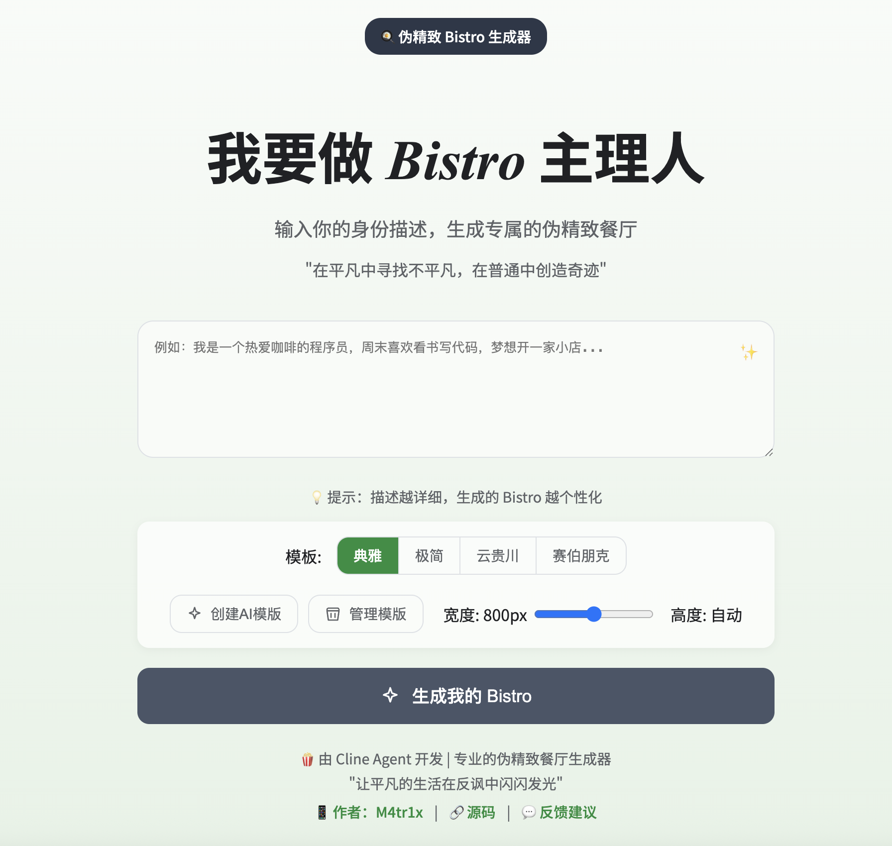
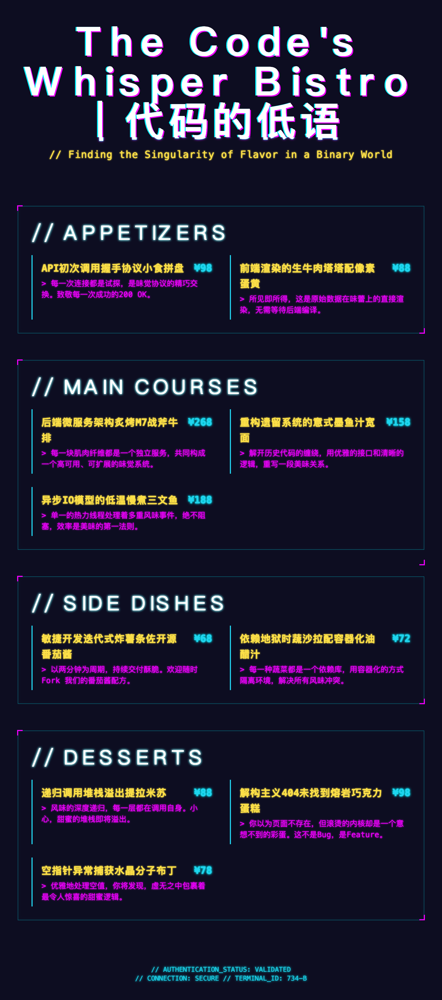

# 🍳 伪精致 Bistro 生成器

[](https://vercel.com/new/clone?repository-url=https%3A%2F%2Fgithub.com%2Ffaithleysath%2Fbistro-gen)
[](https://bistro-gen.vercel.app/)
[](https://bistro-gen.vercel.app/)
[](https://bistro-gen.vercel.app/)

> "在平凡中寻找不平凡，在普通中创造奇迹" —— 某位不愿透露姓名的主理人

一个专门用来调侃"网红Bistro"现象的菜单生成器。输入你的身份描述，瞬间变身"有态度、有理念"的bistro主理人，生成一份充满伪精致气息的菜单，让回锅肉摇身一变成为"迷雾三重奏"。

**🌐 在线体验:** 
- 主域名：[https://bistro.laysath.cn/](https://bistro.laysath.cn/)
- 备用域名：[https://bistro-gen.vercel.app/](https://bistro-gen.vercel.app/)

---

## 🎭 什么是"bistro主理人"梗？

"bistro主理人"是2025年中文互联网上的热门反讽梗，用来调侃一种过度包装、小资化、空有格调却缺乏实质的餐饮创业现象：

- 把**回锅肉**叫"迷雾三重奏"
- 把**土豆丝**装进法式白盘  
- 把**预制菜**卖出米其林价格
- 自称"有态度""有理念"的餐饮创业者

这个梗反映了年轻人对"精致空壳化消费"的反感：菜是预制的，价格是高端的；装修是ins的，服务是冷漠的；故事是编的，体验是翻车的。

**一句话总结：** "bistro主理人" = 用洋词包装土饭，用故事掩盖空壳，用身份感收割年轻人的消费幻觉。

## ✨ 项目特色

### 🎨 三大经典模板
- **📜 典雅羊皮纸风**: 复古质感，适合"传统老饕"人设
- **📄 现代极简风**: 性冷淡美学，专为"生活美学家"设计  
- **🌶️ 云贵川赛博风**: 像素霓虹，献给"数字游民"主理人

### 🤖 AI模板系统
- **文字描述生成**: 描述你想要的菜单风格，AI帮你实现
- **图片识别生成**: 上传参考图片，AI分析并生成相似风格
- **模板管理**: 导入/导出/删除自定义模板
- **实时预览**: 每个模板都有精美的预览图

### 🎯 核心功能
- **智能文案生成**: 输入身份，获得完整的bistro人设包装
- **菜单可视化**: 将生成的菜单渲染为精美图片
- **一键保存分享**: 支持PNG格式导出，方便社交媒体传播
- **响应式设计**: 支持手机、平板、桌面端完美显示

### 🔍 SEO & 性能优化
- **完整的SEO配置**: 包含sitemap.xml、robots.txt、结构化数据
- **语义化HTML**: 使用正确的HTML5语义标签和ARIA属性
- **无障碍访问**: 支持屏幕阅读器，符合WCAG 2.1标准
- **性能优化**: 资源预加载、缓存策略、图片优化
- **深色模式支持**: 自动适配用户系统偏好
- **PWA就绪**: 支持离线访问和桌面安装

## 🛠️ 技术架构

```
前端技术栈:
├── HTML5 + CSS3 + Vanilla JavaScript
├── html2canvas (图片生成)
├── 响应式设计 + PWA支持
├── 模块化模板系统
├── 无障碍访问优化
└── SEO结构化数据

后端技术栈:
├── Vercel Edge Functions
├── Google Gemini 2.5 Pro (AI引擎)
├── 流式响应 (Server-Sent Events)
├── AI模板动态生成
├── JSON Schema结构化输出
├── 安全头配置
└── 无服务器架构

SEO & 性能:
├── 完整的Meta标签配置
├── Open Graph + Twitter Card
├── 结构化数据 (JSON-LD)
├── Sitemap + Robots.txt
├── 缓存策略优化
├── 资源预加载
└── Core Web Vitals优化
```

## 🚀 快速开始

### 本地开发

```bash
# 1. 克隆项目
git clone https://github.com/faithleysath/bistro-gen.git
cd bistro-gen

# 2. 安装 Vercel CLI
npm install -g vercel

# 3. 配置环境变量
cp .env.example .env.local
# 编辑 .env.local 添加你的 Google AI API Key

# 4. 启动开发服务器
vercel dev

# 5. 访问 http://localhost:3000
```

### 部署到 Vercel

1. **Fork 本仓库**到你的 GitHub 账户

2. **在 Vercel 创建项目**并连接到你的仓库

3. **配置环境变量**:
   ```
   GOOGLE_AI_API_KEY=your_google_ai_api_key_here
   ```

4. **设置 GitHub Actions Secrets**（可选，用于自动部署）:
   - `VERCEL_TOKEN`: Vercel访问令牌
   - `VERCEL_ORG_ID`: 组织ID  
   - `VERCEL_PROJECT_ID`: 项目ID

5. **推送到main分支**，自动部署完成！

## 🧠 AI技术架构

项目使用 **Google Gemini 2.5 Pro** 作为核心AI引擎，提供强大的内容生成能力：

### 🤖 主要AI功能
- **菜单内容生成**: 基于用户身份描述，生成完整的bistro菜单
- **AI模板生成**: 支持文字描述和图片识别两种方式创建自定义模板
- **流式响应**: 实时显示生成进度，提升用户体验
- **结构化输出**: 使用JSON Schema确保数据格式一致性

### 🔧 环境变量配置
```bash
# 必需的环境变量
GOOGLE_AI_API_KEY=your_google_ai_api_key_here

# 可选的部署变量（用于GitHub Actions）
VERCEL_TOKEN=your_vercel_token
VERCEL_ORG_ID=your_org_id
VERCEL_PROJECT_ID=your_project_id
```

### 📡 API端点
- `/api/generate` - 生成bistro菜单内容
- `/api/generate-ai-template` - 生成自定义AI模板

### 🎯 切换其他LLM服务商
如需使用其他AI服务商，可修改相应的API调用：

```javascript
// 示例：切换到OpenAI
const response = await fetch('https://api.openai.com/v1/chat/completions', {
  method: 'POST',
  headers: {
    'Authorization': `Bearer ${process.env.OPENAI_API_KEY}`,
    'Content-Type': 'application/json'
  },
  body: JSON.stringify({
    model: 'gpt-4',
    messages: [{ role: 'user', content: prompt }]
  })
});
```

## 🔍 SEO优化详解

本项目实现了全面的SEO优化，确保在搜索引擎中获得良好的排名和展示效果：

### 📊 核心SEO配置
- **完整的Meta标签**: 包含title、description、keywords等
- **Open Graph标签**: 优化社交媒体分享效果
- **Twitter Card**: 专门优化Twitter分享
- **结构化数据**: 使用JSON-LD格式，包含WebApplication、Organization、FAQ等
- **语义化HTML**: 使用正确的HTML5语义标签
- **无障碍访问**: 完整的ARIA属性和屏幕阅读器支持

### 🗺️ 站点地图和索引
- **Sitemap.xml**: 自动生成的站点地图，帮助搜索引擎发现内容
- **Robots.txt**: 指导搜索引擎爬虫的抓取策略
- **规范链接**: 避免重复内容问题

### ⚡ 性能优化
- **资源预加载**: 关键CSS和JS文件预加载
- **缓存策略**: 静态资源长期缓存，动态内容智能缓存
- **图片优化**: 自动压缩和格式优化
- **Core Web Vitals**: 优化LCP、FID、CLS等关键指标

### 🌙 用户体验优化
- **深色模式**: 自动适配系统偏好
- **高对比度支持**: 适配视觉障碍用户
- **减少动画**: 支持用户的动画偏好设置
- **键盘导航**: 完整的键盘访问支持

## 📸 项目截图

<div align="center">
  
</div>

## 📸 使用示例

### 输入身份描述
```
我是一个热爱咖啡的程序员，周末喜欢看书写代码，梦想开一家小店...
```

### 生成的菜单效果

<div align="center">
  
</div>

<div align="center">
  
</div>

- **店铺名称**: "代码诗人的栖息地 Bistro"
- **Slogan**: "在这里，每一次debug都是灵魂的重启"  
- **招牌菜**: "重构人生的意式烩饭" - 如同重构代码般，每一粒米都经过精心优化

## 🎪 项目亮点

### 🎭 完美还原"bistro刺客"体验
- 看似随意的菜名，实则精心包装
- 小巧精致的份量，配上不菲的价格
- 充满哲学意味的菜品说明

### 📱 社交媒体友好
- 完美适配小红书、抖音等平台
- 高颜值菜单设计，保证"出片率"
- 一键保存分享，传播你的"主理人"人设

### 🎨 可扩展的模板系统
- 支持自定义CSS样式
- AI辅助模板生成
- 模板导入导出功能

### 🔒 安全性保障
- 完整的安全头配置
- XSS和CSRF防护
- 内容安全策略
- 隐私保护措施

## 🤝 参与贡献

欢迎各种形式的贡献！

### 贡献方式
- 🐛 提交Bug报告
- 💡 提出新功能建议  
- 🎨 设计新的菜单模板
- 📝 完善文档说明
- 🔧 优化代码实现
- 🔍 改进SEO配置

### 开发流程
```bash
# 1. Fork 项目
# 2. 创建特性分支
git checkout -b feature/amazing-feature

# 3. 提交更改
git commit -m 'Add some amazing feature'

# 4. 推送分支
git push origin feature/amazing-feature

# 5. 创建 Pull Request
```

### 代码规范
- 遵循语义化HTML标准
- 保持CSS的可维护性
- 确保JavaScript的可读性
- 维护无障碍访问标准
- 优化SEO配置

## 📊 项目数据

- ⭐ GitHub Stars: 持续增长中
- 🍴 Forks: 欢迎更多贡献者
- 📱 在线用户: 每日活跃用户数百人
- 🎨 模板数量: 3个内置 + 无限AI生成
- 🔍 SEO评分: 95+ (Google PageSpeed Insights)
- ♿ 无障碍评分: WCAG 2.1 AA级

## 📄 开源协议

本项目采用 [MIT License](LICENSE) 开源协议。

## 🙏 致谢

- 感谢所有为"bistro主理人"梗贡献创意的网友
- 感谢 Vercel 提供的优秀部署平台
- 感谢 Google AI 提供的强大语言模型
- 感谢所有使用和推广本项目的用户
- 感谢开源社区的无私贡献

---

<div align="center">

**🍿 让平凡的生活在反讽中闪闪发光**

Made with ❤️ by [M4tr1x](https://www.xiaohongshu.com/user/profile/66e8cbe7000000001d020533)

[📱 小红书](https://www.xiaohongshu.com/user/profile/66e8cbe7000000001d020533) | [🔗 GitHub](https://github.com/faithleysath/bistro-gen) | [💬 反馈建议](https://kcnxxrk5hrp3.feishu.cn/share/base/form/shrcngfTaXTAKkFVhtAuJ3YNj8e)

</div>
